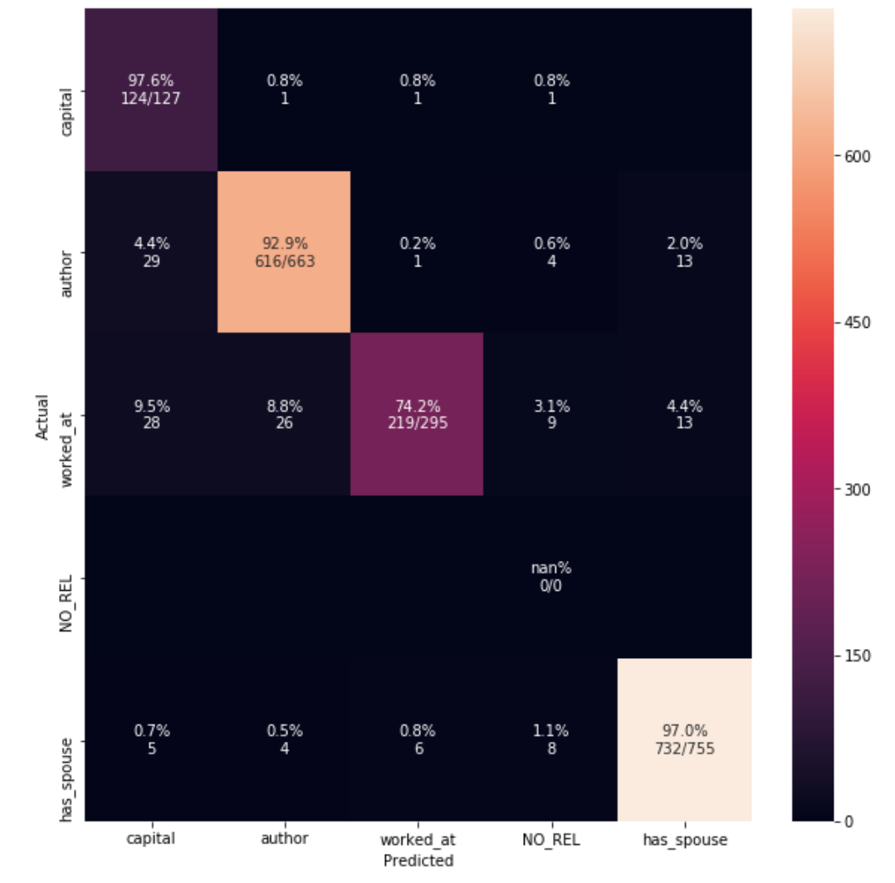

### Scores for tested models.

**model**	| **score**  Mean cv score (StratifiedKFold)	| **comments** |
----- | ----------------------------------------|----------------------|
| BASELINE | 0.7745792487781428 |
| TF-IDF |	0.750413578679886 |
| lemmatization |	0.7664650091110985 |
| without stop words  | 0.7703493969295923 |
| max_df=0.7  | 0.7721823825450114 |
| word2vec (trained on our data) | 0.7004649820878264 | only entities are vectorized; tested on train data only |
| pretrained word2vec | 0.5483315593034295 | context words vectorized (without entities; see more below |
| |
| CountVectorizer(ngram_range=(1,3)) | 0.797 | :boom: |
| |
| BASELINE + EntityLength |	0.7818803012927732 |	unions features |
| BASELINE + EntityLength + SimpleFeats |	0.8108522380368186 |
| BASELINE + EntityLength + SimpleFeats (with POS tags)	| 0.8279038078401164 |
| BASELINE + ngram range(1, 3) + EntityLength + SimpleFeats (with POS tags) |	0.8549579216500934 |
| |
| ngram range(1, 3) + splitting data | 0.850 | :boom: |
| |
| splitting data + ngram range(1, 3) + EntityLength + SimpleFeats + SyntacticFeats |	0.8721445323326972 |	best result but very time consuming |
| splitting data + ngram range(1, 3) + EntityLength + SimpleFeats	| 0.869709024613503	| final result 10/12/18

### Confusion Matrix

