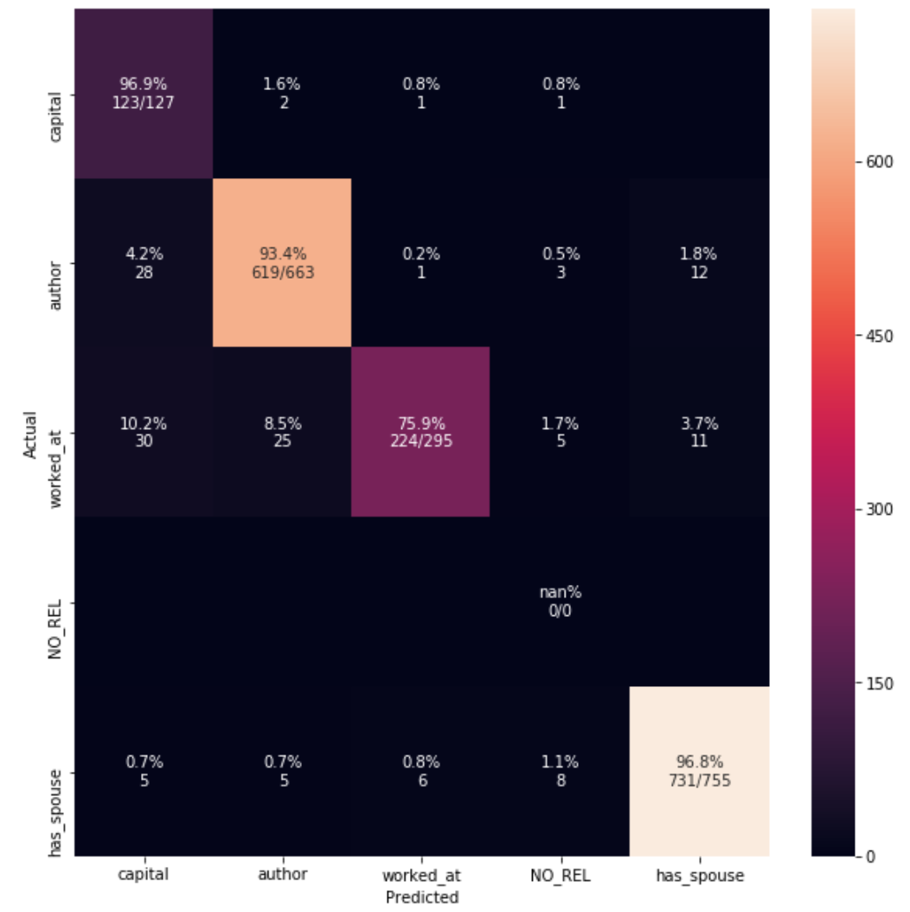

### Cross validation scores for baseline:
|relation           |   precision |     recall|    f-score|    support |
|------------------  |  --------- | --------- | --------- | ---------  |
|NO_REL              |      0.661 |     0.713 |     0.671  |     2300 |
|author              |      0.815 |     0.813 |     0.814  |     2653 |
|capital             |      0.883 |     0.639 |     0.820  |      510 |
|has_spouse          |      0.860 |     0.902 |     0.868  |     3019 |
|worked_at           |      0.727 |     0.611 |     0.700  |     1178 |
|------------------  |  --------- | --------- | ---------  |--------- |
|macro-average       |      0.789 |     0.736 |     0.775  |     9660|

### Cross validation scores for final model:

|relation          | precision | recall  |  f-score  | support |
|------------------| ----------| ---------| ---------| ---------|
|NO_REL            | 0.776    |  0.398   |  0.652   |  3068 |
|author            | 0.933    |  0.971   |  0.941   |  13113 |
|capital           | 0.938    |  0.972   |  0.945   |  9427 |
|has_spouse        | 0.910    |  0.978   |  0.923   |  13061 |
|worked_at         | 0.903   |   0.815   |  0.884   |  3669 |
|------------------| ----------| ---------| ---------| ---------|
|macro-average     | 0.892  |    0.827    | 0.869  |   42338 |

### Baseline scores on test data:

|relation    |       precision | recall  |  f-score |  support|
|------------------| ----------| --------- |--------- |---------|
|NO_REL       |      0.000   |   0.000 |    0.000 |    0  |
|author        |     0.923  |    0.864  |   0.910  |   663|
|capital       |     0.948  |    0.575   |  0.839  |   127|
|has_spouse    |     0.932   |   0.947   |  0.935  |   755|
|worked_at    |      0.852   |   0.566   |  0.774  |   295|
|------------------ |---------- |---------| ---------| --------- |
|macro-average  |    0.734   |   0.594  |   0.695   |  1840|

### Final scores on test data:

|relation       |    precision | recall |   f-score |  support|
|------------------| ----------| ---------| ---------| ---------|
|NO_REL      |       0.000  |    0.000  |   0.000  |   0|
|author      |       0.951   |   0.934  |   0.947  |   663|
|capital     |       0.661  |    0.969  |   0.706  |   127|
|has_spouse  |       0.969  |    0.968  |   0.969  |   755|
|worked_at   |       0.966  |    0.759  |   0.916  |   295|
|------------------ |----------| ---------| ---------|---------|
|macro-average    |  0.709    |  0.726   |  0.708  |   1840|

### Scores for tested models.

**model**	| **score**  Mean cv score (StratifiedKFold)	| **comments** |
----- | ----------------------------------------|----------------------|
| BASELINE | 0.7745792487781428 |
| TF-IDF |	0.750413578679886 |
| lemmatization |	0.7664650091110985 |
| without stop words  | 0.7703493969295923 |
| max_df=0.7  | 0.7721823825450114 |
| word2vec (trained on our data) | 0.7004649820878264 | only entities are vectorized; tested on train data only |
| pretrained word2vec | 0.5483315593034295 | context words vectorized (without entities; see more below |
| |
| CountVectorizer(ngram_range=(1,3)) | 0.797 | :boom: |
| |
| BASELINE + EntityLength |	0.7818803012927732 |	unions features |
| BASELINE + EntityLength + SimpleFeats |	0.8108522380368186 |
| BASELINE + EntityLength + SimpleFeats (with POS tags)	| 0.8279038078401164 |
| BASELINE + ngram range(1, 3) + EntityLength + SimpleFeats (with POS tags) |	0.8549579216500934 |
| |
| ngram range(1, 3) + splitting data | 0.850 | :boom: |
| |
| splitting data + ngram range(1, 3) + EntityLength + SimpleFeats + SyntacticFeats |	0.8721445323326972 |	best result but very time consuming |
| splitting data + ngram range(1, 3) + EntityLength + SimpleFeats	| 0.869709024613503	| final result 10/12/18

### Confusion Matrix

